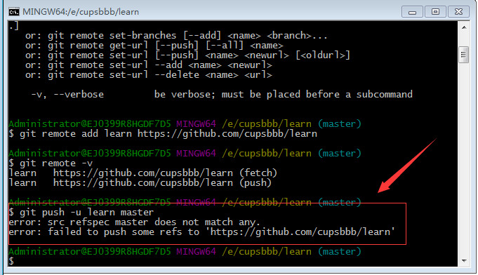
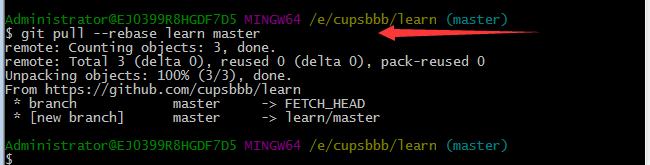

# 我在使用git中遇到的问题-md1

### 我在第一次将本地库推送到远程 使用 git push 命令时，遇到了如下问题
```
> gitpush -u learn master
> error:src refspec master does not match any.
> error:failed to push some refs to 'https://github.com/cupsbbb/learn'
```


出现错误的主要原因是 README.me 不在本地库中

解决方案：使用如下命令将本地和远程库合并

```
>git pull --rebase learn master
```


此时再执行git push -u learn master 即可提交代码到github